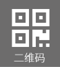

#1. 清除某些标签自带属性
	1. <a> 下划线
	解决方法：a{
    text-decoration: none;
    color: aliceblue;} 
	2. 
 行间隔
	解决方法：p {
    margin: 0;
    padding: 0;}	
	3. <ul> 外边框
	ul {
     list-style-type: none;
    margin: 0;
    padding: 0;}
#2. <a href="https://www.jianshu.com/p/3646a8a55203">规范使用标签</a>
 1. 对于无需自闭合的标签，不允许自闭合。
常见无需自闭合标签有input、br、img、hr等。
 
  2.选择器 与 { 之间必须包含空格。

属性名 与之后的 : 之间不允许包含空格，
 
: 与 属性值 之间必须包含空格。

 列表型属性值 书写在单行时，, 后必须跟一个空格。 

3.. **.end  .text .goods**

	

#3.矢量图片
  <a href="https://www.iconfont.cn/collections/index?spm=a313x.7781069.1998910419.4&type=1"> iconfont阿里巴巴矢量图片</a>

i 标签

  <a href="https://www.iconfont.cn/help/detail?spm=a313x.7781069.1998910419.15&helptype=code">帮助</a>
#4. 浮动

  <a href="https://www.cnblogs.com/iyangyuan/archive/2013/03/27/2983813.html?from=singlemessage"> float讲解  标准流</a>

**对于CSS的清除浮动(clear)，一定要牢记：这个规则只能影响使用清除的元素本身，不能影响其他元素。**

 line-heigth

 heigth 

#5.定位 position 
  **relative    absolute   fixed**

#6.<a href="https://blog.csdn.net/booom007/article/details/81203493">CSS实现鼠标经过网页图标弹出微信二维码</a>
     

           
     

**css**

	.tangcuan  {
        margin-top: 200px;
        margin-left: 200px; 
        width: 200px;
        height: 200px;
        border: 1px solid black;}
	
	.weixin {
         position: relative;}

 	.weixin  img.qrcode{
       position: absolute;
       z-index: 500; 
		/*z-index 属性设置元素的堆叠顺序。拥有更高堆叠顺序的元素总是会处于堆叠顺序较低的元素的前面。*/
       top:-100px;
       right:100px;
       width: 200px;/*二维码宽度*/
       max-width: none;
       height:200px;/*二维码高度*/
       transform: scale(0);  
       transform-origin: top left ; /*基点位置 相对于元素中间*/
       opacity: 0; /*透明度*/
       border: .3125rem solid black;
       border-radius: 25px;
      -webkit-transform: all .4s ease-in-out;
       -o-translation: all .4s ease-in-out;
       transition: all .4s ease-in-out;}

 	 .weixin:hover img.qrcode  {
          transform: scale(1);
          opacity: 1;}

 <a href="https://www.cnblogs.com/shuaishuailu/p/5914719.html"> z-index: 500; </a>

##7.

  	/*获取节点li  ul*/
	var qiehuan=document.getElementById("qiehuan").getElementsByTagName("li");

	var qiehuan2=document.getElementById("infm").getElementsByTagName("ul");
		console.log(qiehuan2);
		/*使每一个li标签加一个点击事件*/
	for (var i=0;i<qiehuan.length;i++)
     {
          qiehuan[i].onclick=showList;
     }

			/*循环加判断 使点击到的li 增加一个属性class*/
	function showList(){
     for(var i=0;i<qiehuan.length;i++)
     {
           if(qiehuan[i]==this)
                {qiehuan[i].className="active";
                qiehuan2[i].className="active";
               /*给li标签加上属性的同属给ul加上属性*/}
           else {qiehuan[i].className="";
           qiehuan2[i].className="";}
     }}